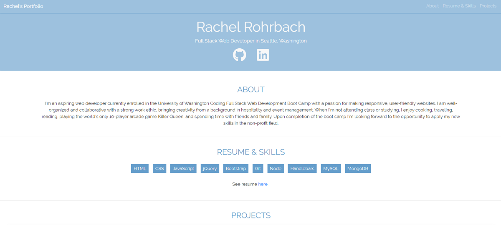

# Portfolio 

## Table of contents
* [General info](#general-info)
* [Technologies](#technologies)
* [Screenshot](#screenshot)
* [Credits](#credits)
* [License](#license)

## General info
This project is my personal web developer portfolio. This project is an improvement on a former website that I built at the beginning of my software boot camp and an updated version that I built a few months ago as I build toward being employer competitive. It contains actual examples of my work including 2 collaborative coding projects and some exemplary homework assignments as well as links to my GitHub repository, deployed projects, LinkedIn profile and resume. 
	
## Technologies
This project is created with: 
* Bootstrap 4
* CSS
* Font Awesome
* Google Fonts

## Screenshot

Link to my deployed github page: 

# Credits
I consulted Bootstrap 4 (https://getbootstrap.com/) and W3Schools (https://www.w3schools.com/howto/howto_css_smooth_scroll.asp) extensively in creating my project. Some other resources that I used include: Stack Overflow (#https://stackoverflow.com/), the GitLab repository for my course, specifically referencing the in-class activities and the ReadMe for homework 8. de

## License
MIT License

Copyright (c) [2020] [Rachel Rohrbach]

Permission is hereby granted, free of charge, to any person obtaining a copy
of this software and associated documentation files (the "Software"), to deal
in the Software without restriction, including without limitation the rights
to use, copy, modify, merge, publish, distribute, sublicense, and/or sell
copies of the Software, and to permit persons to whom the Software is
furnished to do so, subject to the following conditions:

The above copyright notice and this permission notice shall be included in all
copies or substantial portions of the Software.

THE SOFTWARE IS PROVIDED "AS IS", WITHOUT WARRANTY OF ANY KIND, EXPRESS OR
IMPLIED, INCLUDING BUT NOT LIMITED TO THE WARRANTIES OF MERCHANTABILITY,
FITNESS FOR A PARTICULAR PURPOSE AND NONINFRINGEMENT. IN NO EVENT SHALL THE
AUTHORS OR COPYRIGHT HOLDERS BE LIABLE FOR ANY CLAIM, DAMAGES OR OTHER
LIABILITY, WHETHER IN AN ACTION OF CONTRACT, TORT OR OTHERWISE, ARISING FROM,
OUT OF OR IN CONNECTION WITH THE SOFTWARE OR THE USE OR OTHER DEALINGS IN THE
SOFTWARE.